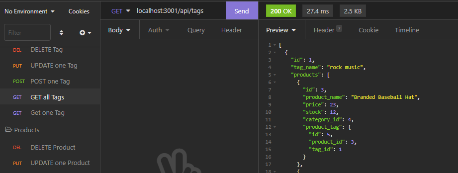

# Money Manager

## Description

Money Manager is a back-end server application that lets a user manage products and related information inside a mysql database. These products are then able to be viewed in full or individually with all relevent info given. The user can also update or delete a product and/or its category and tag. Running the server and making the correct API calls will execute these funcitons.

## Installation

1. Clone the main branch from [GitHub](https://github.com/mimi5930/money-manager)
2. Navigate to the root directory

```
~/money-manager
```

3. Install the node package manager

```
npm install
```

4. create a .env file with the following content in the root directory

```.env
DB_NAME=your_database_name
DB_USER=your_mysql_username
DB_PW=your_mysql_password
```

## Usage

- The following video show the app's functionality

[](https://drive.google.com/file/d/1STFIY2uPro46j0LQnltg2mfJGx3bIaLa/view)

- To use this application, run the app from the root direcotry

```
npm start
```

- Next, use an application like [insomnia](https://insomnia.rest/download) to make requests to the server's endpoints. Watch the runthrough video for more information on which endpoints to use!

## Credits

This project uses:

- [dotenv](https://www.npmjs.com/package/dotenv)
- [expressjs](https://www.npmjs.com/package/express)
- [mysql2](https://www.npmjs.com/package/mysql2)
- [Sequelize](https://www.npmjs.com/package/sequelize)

## Tests

After installing and initializing your database, feel free to run this command to seed your database with example data.

```
npm run seed
```
